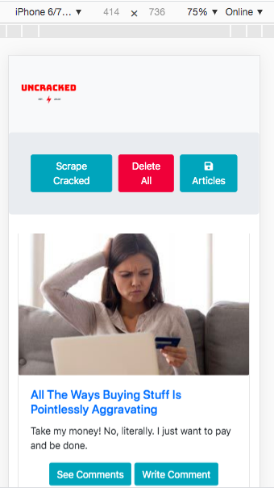
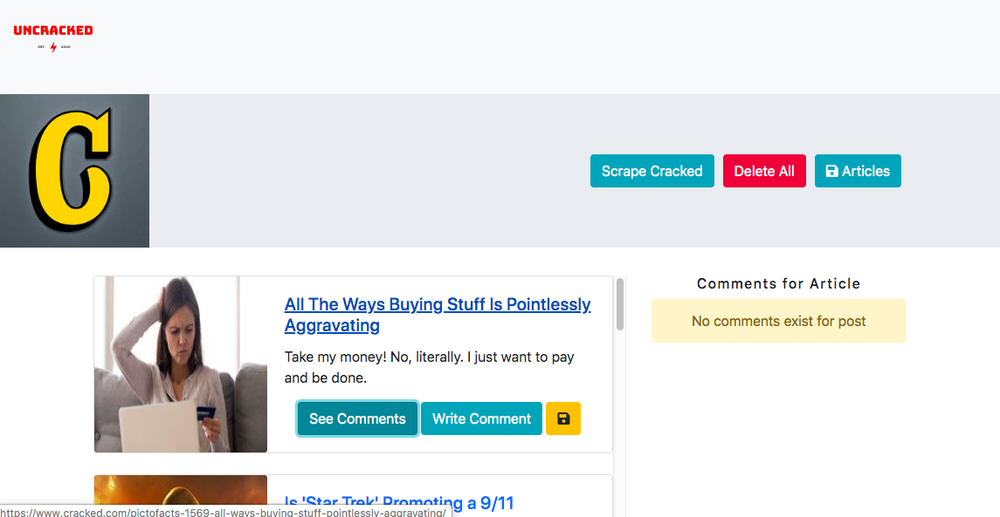

# Scrape with Mongo and Mongoose

## Descriptions

In this project, I created a web app that lets users view and leave comments on Cracked blog post. I used Mongoose and Cheerio to scrape and save blog posts from cracked.com .

## Technolgies Used

1. HTML5
2. CSS3
3. HandleBars
4. Node.js
5. BootStrap
6. JQuery
7. JavaScript
8. Cheerio.js
9. Mongoose

## Mobile view

## Desktop view

## GIf of working App

